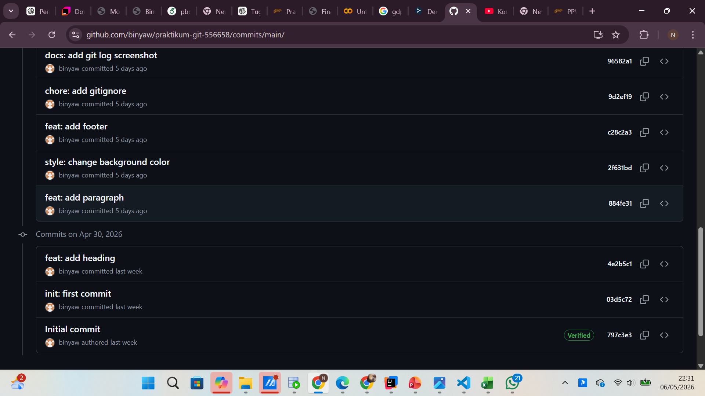
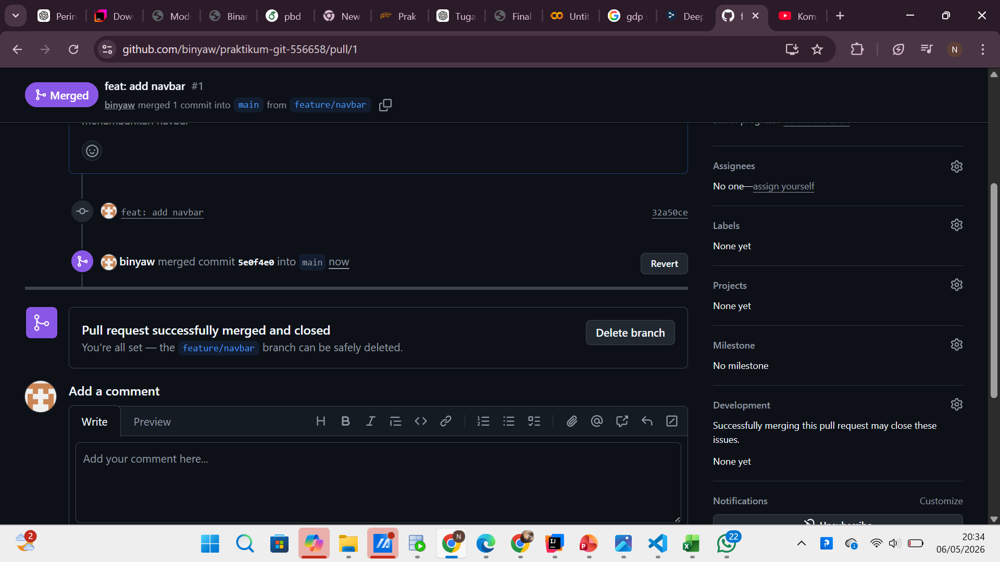
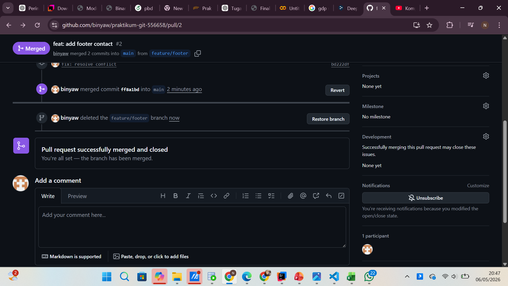
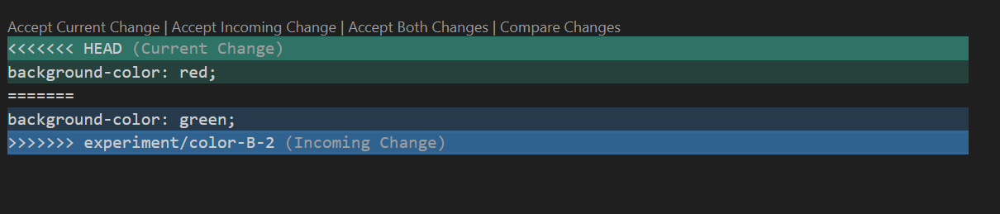

# Praktikum Git

## 📌 Tugas 1: Hasil Git Log

Pada tugas ini, dilakukan beberapa commit dengan menggunakan format Conventional Commits.
Berikut adalah riwayat commit yang telah dilakukan:

---

## 📌 Tugas 2: Branch Protection Rule

Pada tugas ini, dilakukan pengaturan branch protection pada branch `main` agar tidak bisa langsung melakukan push.
Setiap perubahan harus melalui pull request terlebih dahulu.

Berikut adalah hasil konfigurasi branch protection:

1. Feature Navbar
   Digunakan untuk menambahkan bagian navigasi pada website.

   Hasil:
   

---

2. Feature Footer
   Digunakan untuk menambahkan bagian footer pada website.

   Hasil:
   

---

3. Hotfix Typo
   Digunakan untuk memperbaiki kesalahan penulisan (typo) pada website.

   Hasil:
   

Setiap perubahan dilakukan di branch masing-masing, kemudian digabungkan ke branch `main`.

## 📌 Tugas 3: Konflik & Rebase

Pada tahap ini, dibuat dua branch:

* `experiment/color-A`
* `experiment/color-B`

Kedua branch tersebut mengubah bagian yang sama pada file sehingga terjadi konflik saat proses merge.
Konflik kemudian diselesaikan secara manual dengan menggabungkan perubahan.

Hasil konflik:

---

### 🔄 Rebase (Squash Commit)

Dibuat branch `feature/dark-mode`, kemudian melakukan beberapa commit.
Selanjutnya, commit tersebut digabungkan menjadi satu menggunakan teknik squash.
